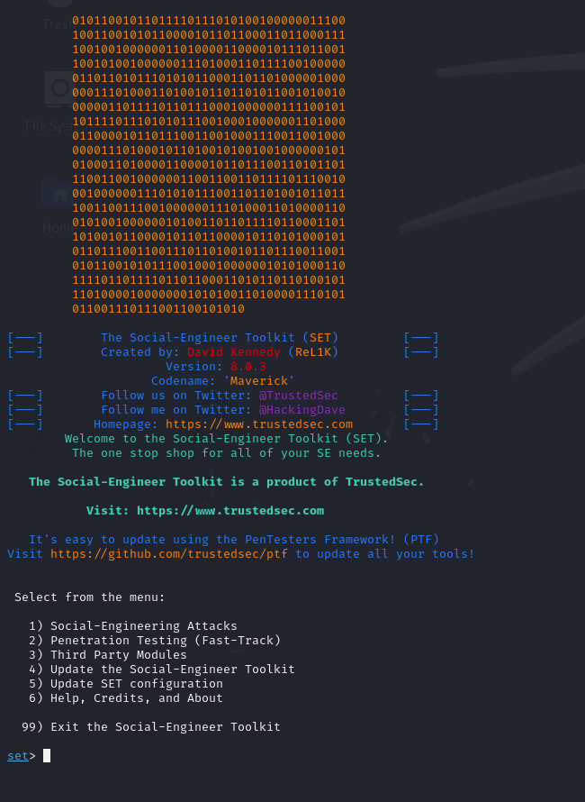
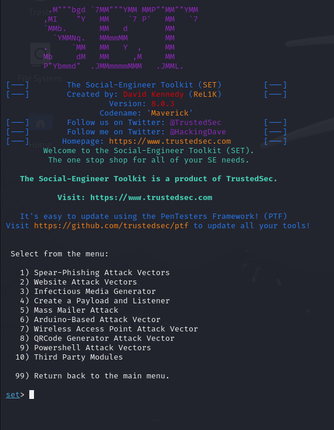
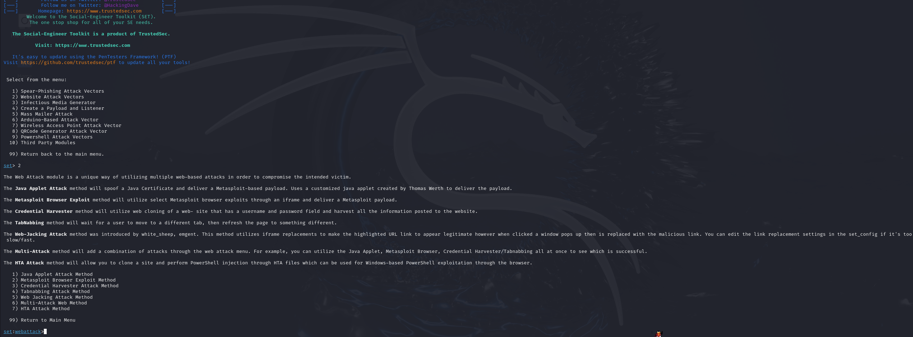
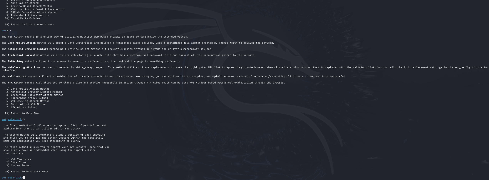
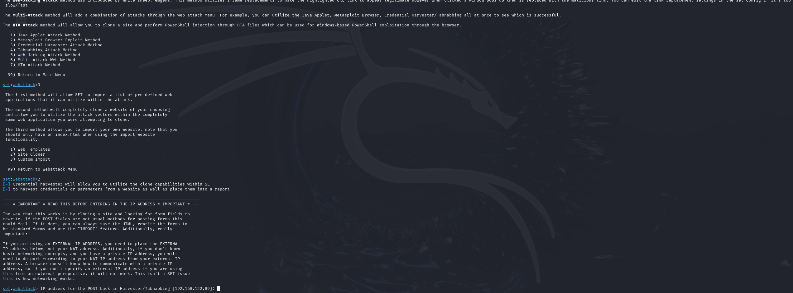
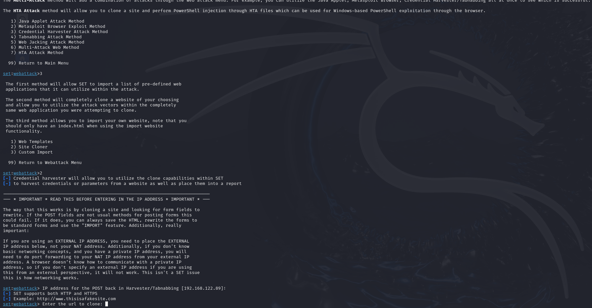
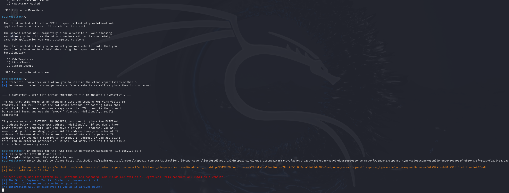
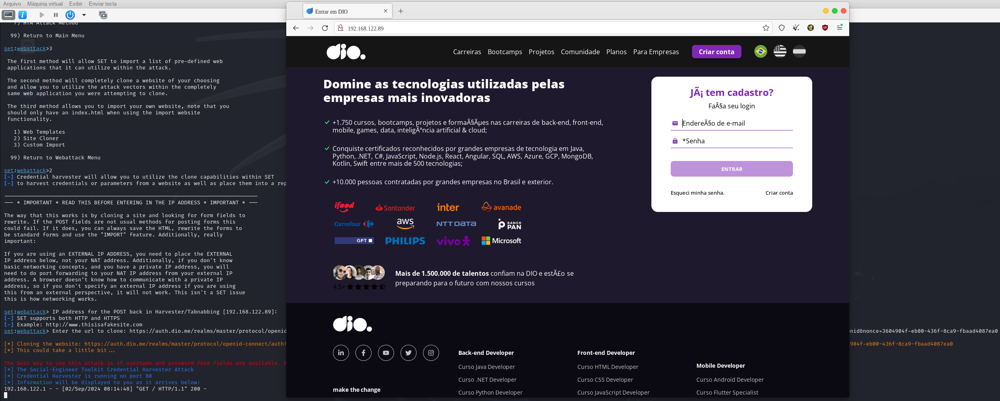
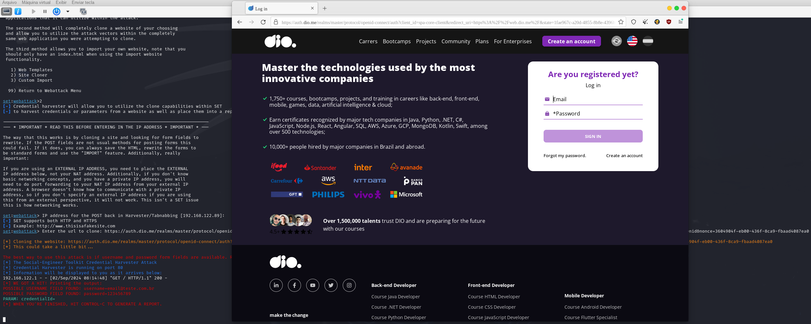
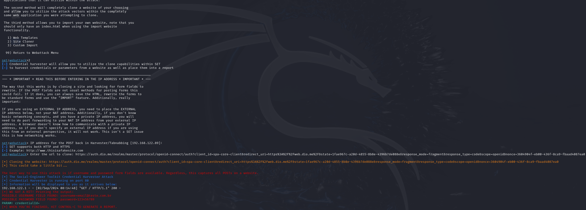

# Criação de um Phishing com o Kali Linux

Neste exemplo eu usarei o site da [DIO](https://auth.dio.me/realms/master/protocol/openid-connect/auth?client_id=spa-core-client&redirect_uri=https%3A%2F%2Fweb.dio.me%2F&state=1fae967c-a20d-4855-8b8e-4396b7de088e&response_mode=fragment&response_type=code&scope=openid&nonce=3604904f-eb00-436f-8ca9-fbaad4087ea0)

1) Entrando como usuário root no Kali Linux -> ```sudo su```


2) Iniciando o setoollkit -> ```setoolkit```



3) Selecionando o ataque de engenharia social com a opção "1" -> ```1```



4) Selecionando o vetor de ataque "Website Attack Vectors" sendo a opção "2" -> ```2```



5) Selecionando o "Credential Harvester Attack Method" sendo a opção "3" -> ```3```



6) Selecionando o "Site Cloner" sendo a opção "2" para realizar a clonagem do site da [DIO](https://auth.dio.me/realms/master/protocol/openid-connect/auth?client_id=spa-core-client&redirect_uri=https%3A%2F%2Fweb.dio.me%2F&state=1fae967c-a20d-4855-8b8e-4396b7de088e&response_mode=fragment&response_type=code&scope=openid&nonce=3604904f-eb00-436f-8ca9-fbaad4087ea0) -> ```2```



6) Aqui é onde é configurado o IP a ser disponibilizado, no caso eu deixei o já fornecido pela ferramenta apenas pressionando a tecla "Enter"



7) Agora estou passando a URL do site a ser clonado, lembrando que estou exemplificando utilizando o site da [DIO](https://auth.dio.me/realms/master/protocol/openid-connect/auth?client_id=spa-core-client&redirect_uri=https%3A%2F%2Fweb.dio.me%2F&state=1fae967c-a20d-4855-8b8e-4396b7de088e&response_mode=fragment&response_type=code&scope=openid&nonce=3604904f-eb00-436f-8ca9-fbaad4087ea0)




8) Aqui estou acessando o site atráves do IP informado na ferramenta.




9) Aqui eu faço a inserção de um e-mail e senha para testar a recuperação das informações via terminal. No teste eu inseri:
 - e-mail: email@teste.com.br
 - senha: 123456789



