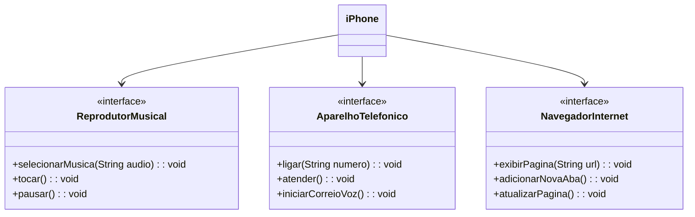

### UML via Mermaid

```mermaid
classDiagram
    class ReprodutorMusical {
        <<interface>>
        +selecionarMusica(String audio): void
        +tocar(): void
        +pausar(): void
    }

    class AparelhoTelefonico {
        <<interface>>
        +ligar(String numero): void
        +atender(): void
        +iniciarCorreioVoz(): void
    }

    class NavegadorInternet {
        <<interface>>
        +exibirPagina(String url): void
        +adicionarNovaAba(): void
        +atualizarPagina(): void
    }

    class iPhone {
    }

    iPhone --> ReprodutorMusical
    iPhone --> AparelhoTelefonico
    iPhone --> NavegadorInternet
```
